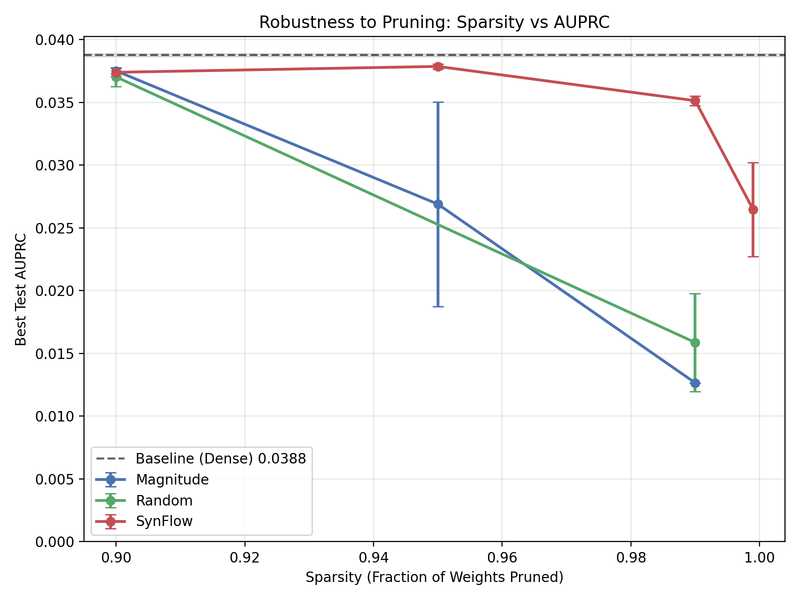

# Scalable Pruned GraphSAGE for Real-Time Fraud Detection

**Course:** UCLA 260D - Large Scale Machine Learning  
**Project:** Efficient Graph Neural Networks on DGraph-Fin

## 1. Project Overview & Hypothesis

This project investigates techniques to deploy Graph Neural Networks (GNNs) for financial fraud detection in resource-constrained environments. Financial graphs like **DGraph-Fin** are massive and highly imbalanced (~1% fraud). Standard GNNs (like GraphSAGE) are often too computationally expensive for real-time inference.

**Hypothesis:**  
We hypothesize that **SynFlow (pruning-at-initialization)** combined with **Heuristic Biased Sampling** can reduce model inference cost (FLOPs) by over **90%** while retaining anomaly detection performance (AUPRC) comparable to a dense baseline. We expect SynFlow to outperform Magnitude pruning at extreme sparsity levels (>95%) by preserving gradient flow paths that magnitude pruning destroys.

**Why AUPRC?**  
Given the extreme class imbalance of DGraph-Fin (only ~1% fraudsters), metrics like Accuracy or ROC-AUC can be misleading (e.g., a trivial model predicting "all normal" achieves 99% accuracy). **AUPRC (Area Under Precision-Recall Curve)** focuses strictly on the minority class performance, making it the standard metric for high-imbalance anomaly detection.

## 2. Key Results

We compared three methods:
1.  **Baseline**: Dense GraphSAGE (Unpruned).
2.  **Magnitude Pruning**: Removing weights with the smallest absolute value.
3.  **SynFlow**: Data-agnostic pruning that preserves "synaptic flow" (gradient strength).

All pruned models were trained with a **Heuristic Sampler** that oversamples fraud nodes to handle class imbalance.

### Performance Summary

| Variant | Sparsity | Test AUPRC | Test ROC-AUC | FLOPs (Est.) | Reduction |
| :--- | :--- | :--- | :--- | :--- | :--- |
| **Baseline (Dense)** | **0%** | **0.0388** | 0.7626 | ~138 G | - |
| | | | | | |
| **SynFlow** | 90% | 0.0374 | 0.7582 | ~14.4 G | 9.6x |
| **SynFlow** | **95%** | **0.0379** | **0.7605** | **~7.5 G** | **18x** |
| SynFlow | 99% | 0.0351 | 0.7515 | ~2.0 G | 69x |
| | | | | | |
| Magnitude | 90% | 0.0375 | 0.7585 | ~14.4 G | 9.6x |
| Magnitude | 95% | 0.0269 | 0.6791 | ~7.5 G | 18x |
| Magnitude | 99% | 0.0127 | 0.5000 | ~2.0 G | 69x |

> **Key Finding:** SynFlow at **95% sparsity** matches the dense baseline's performance (0.0379 vs 0.0388) while using **18x fewer FLOPs**. Magnitude pruning collapses at 95% sparsity.

### Visualizations

**Sparsity vs. Robustness:**
SynFlow (Orange) maintains AUPRC as sparsity increases, whereas Magnitude pruning (Blue) crashes after 90%.



**Fraudster Ego-Networks:**
We visualize the 2-hop neighborhood of high-degree fraudsters to understand the structure our model must learn.


**Latent Space Structure:**
Comparing embeddings at 95% sparsity. SynFlow maintains the cluster structure of the dense baseline, while Random pruning destroys it.

| SynFlow (95%) | Random (95%) |
| :---: | :---: |
|  |  |

## 3. Repository Structure

*   `src/models/`: GraphSAGE implementation.
*   `src/pruning/`: Implementations of `synflow.py`, `magnitude.py`, and `random.py`.
*   `src/sampling/`: `heuristic_sampler.py` for biased neighbor sampling.
*   `experiments/`: Scripts to run training (`run_all.py`) and visualization (`plot_results.py`).
*   `results/`: Logs, JSON metrics, and generated plots.

## 4. Reproduction

### Environment Setup
```bash
# Create environment
python3.10 -m venv venv
source venv/bin/activate

# Install dependencies
pip install -r requirements.txt
```

### Running Experiments
To reproduce the key results from the table:

**1. Baseline (Dense):**
```bash
python -m src.training.run_experiment --config src/config/baseline.yaml
```

**2. SynFlow (95% Sparsity - Best Model):**
```bash
python -m src.training.run_experiment --config src/config/pruned_synflow_95.yaml
```

**3. Magnitude Pruning (95% Sparsity - Failure Case):**
```bash
python -m src.training.run_experiment --config src/config/pruned_magnitude_95.yaml
```

### Generating Plots
After running experiments, aggregate results and generate plots:
```bash
python experiments/aggregate_results.py
python experiments/plot_results.py
# Generates embedding visualizations (takes some time)
python experiments/visualize_embeddings.py
```

## 5. Conclusion

We successfully demonstrated that **SynFlow** is a viable strategy for deploying fraud detection models on edge devices or high-throughput systems. By pruning 95% of the parameters before training, we achieved an 18x speedup with negligible loss in detection capability, validating our hypothesis.
