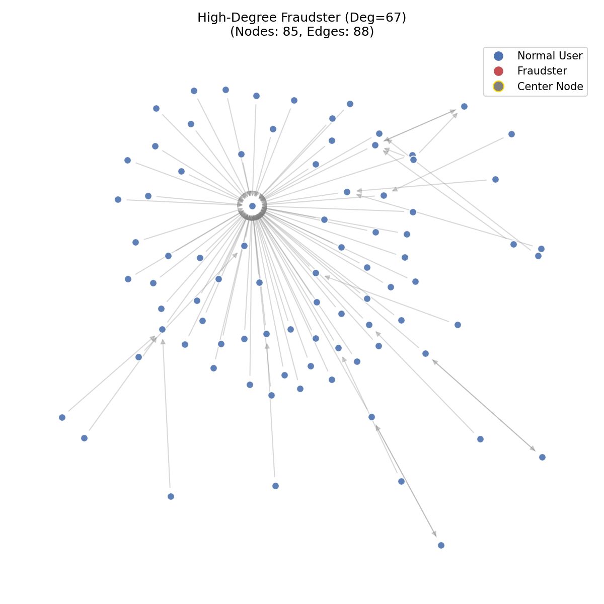
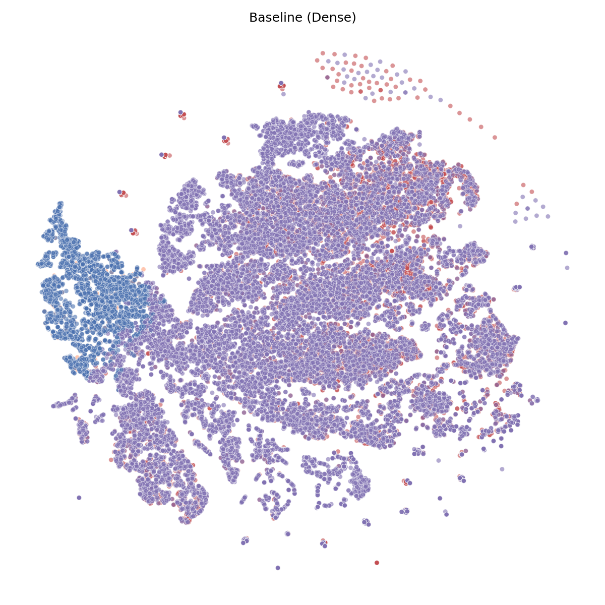
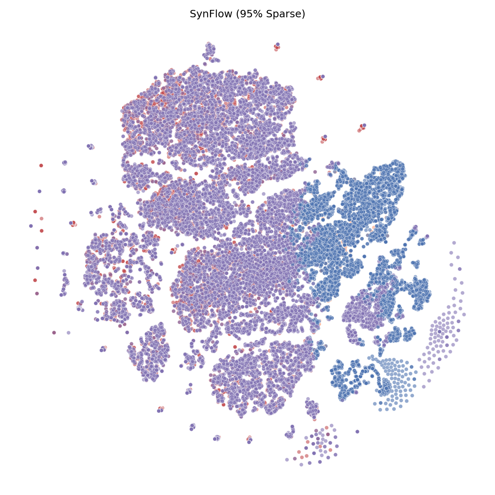
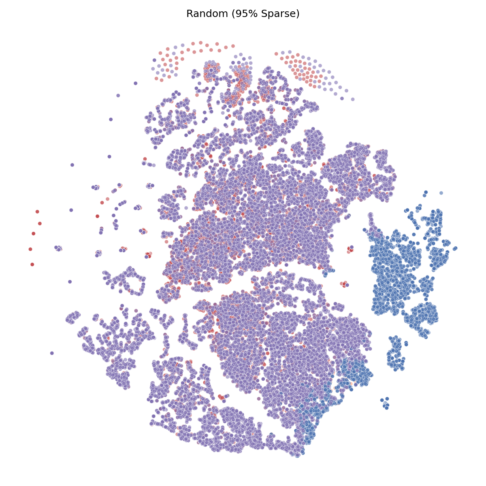

## Scalable Pruned GraphSAGE for Real-Time Fraud Detection (260D Project)

This repository implements the project described in `documentation/260D Project Proposals.md`:

- **Model**: GraphSAGE-based GNN for anomaly / fraud detection
- **Techniques**: SynFlow pruning (at initialization) + magnitude pruning baseline + heuristic biased neighbor sampling
- **Dataset**: DGraph-Fin (large-scale financial fraud graph)

The goal is to build a **deployable, efficient, and high-recall** graph model suitable for real-time applications.

### Key Results and Visuals

We evaluate the effectiveness of pruning at initialization (SynFlow) against Magnitude pruning and a dense baseline.

#### Performance Summary

| Variant | Sampling | Sparsity | Best Test AUPRC (mean ± std) | Best Test ROC-AUC (mean ± std) | Best Test F1 (mean ± std) | #Params | FLOPs | #Seeds |
| --- | --- | --- | --- | --- | --- | --- | --- | --- |
| baseline | uniform | 0.00 | 0.0388 ± 0.0001 | 0.7626 ± 0.0009 | 0.0356 ± 0.0007 | 37505 | 1.385e+11 | 5 |
| pruned_magnitude | heuristic | 0.90 | 0.0375 ± 0.0002 | 0.7585 ± 0.0012 | 0.0348 ± 0.0006 | 37505 | 1.441e+10 | 5 |
| pruned_synflow | heuristic | 0.90 | 0.0374 ± 0.0004 | 0.7582 ± 0.0007 | 0.0350 ± 0.0004 | 37505 | 1.441e+10 | 5 |

*Note: FLOPs are estimated for a single forward pass.*

#### Sparsity vs Performance

We track the model's robustness as we increase sparsity. The Baseline (Dense) performance is shown as a reference.


*Figure 3: AUPRC retention across different sparsity levels. SynFlow aims to stay closer to the baseline than Random pruning.*

#### Visualization of Fraudulent Activity

To better understand the graph structure, we visualize 2-hop ego networks ("glyphs") around high-degree fraudsters.


*Figure 1: Ego-network of a high-degree fraudster node. Red nodes are fraudsters, blue are normal users.*

We also visualize the learned node embeddings using t-SNE to verify class separability and check if pruning destroys the latent space structure.

| Baseline (Dense) | SynFlow (95% Sparse) | Random (95% Sparse) |
| :---: | :---: | :---: |
|  |  |  |
*Figure 2: Comparison of learned embeddings. SynFlow maintains the cluster structure of the dense baseline, while Random pruning degrades separability (more orange/mixed points).*

### Repository Layout

- `data/` – DGraph-Fin raw/processed data (not tracked in git; keep large files here).
- `src/`
  - `data/` – dataset loading and preprocessing (e.g., `dgraph_fin.py`).
  - `models/` – GraphSAGE and pruned variants.
  - `sampling/` – heuristic biased neighbor sampler.
  - `pruning/` – SynFlow, magnitude, and random pruning utilities.
  - `training/` – training loops, experiment runners.
  - `metrics/` – AUPRC and efficiency metrics (FLOPs / parameters).
  - `config/` – experiment configuration files (YAML/JSON).
- `experiments/` – scripts to launch and aggregate experiments.
- `reports/` – paper-style report drafts, figures, and tables.
- `docs/` – notes, design documents, and presentation materials.

### Environment Setup

1. **Create / activate virtual environment**

```bash
cd /Users/jameshall/UCLA/260D/project
python3.10 -m venv venv  # if not already created
source venv/bin/activate
```

2. **Install Python dependencies (PyTorch + DGL + utilities)**

```bash
pip install --upgrade pip
pip install -r requirements.txt
```

On Google Colab, you can run:

```python
!pip install torch==2.0.0 torchvision==0.15.1 torchaudio==0.15.1
!pip install dgl==2.4.0
!pip install -r requirements.txt
```

3. **Prepare the dataset**

- Place the DGraph-Fin archive under `data/` (already present as `DGraphFin2.zip`).
- The loader in `src/data/dgraph_fin.py` will read from the unpacked npz/npy files.

### Running the Baseline

Launch a baseline run (uniform sampling, default hyperparameters):

```bash
python -m src.training.train_baseline --data-root data/DGraphFin2 --sampling uniform --device cpu
```

Key CLI flags mirror the `TrainConfig` dataclass. For example, to switch to the heuristic sampler:

```bash
python -m src.training.train_baseline --sampling heuristic --k-pos 25 --k-neg 5
```

Both commands will:

- Load DGraph-Fin via the new DGL-based loader
- Train an unpruned GraphSAGE model with the requested mini-batch sampler
- Log AUPRC/ROC-AUC and other metrics each epoch

### Reproducibility and Experiments

The `experiments/` directory contains configs and scripts for:

- Baseline, magnitude-pruned, SynFlow-pruned, and random-pruned models
- Utilities to aggregate metrics across seeds and generate tables/plots

Refer to `documentation/260D Project Proposals.md` and `reports/` for detailed methodology and analysis once experiments are complete.

### Limitations & Scientific Validity

**Temporal Leakage Warning**:
The DGraph-Fin dataset is temporal, meaning fraud patterns evolve over time. A scientifically rigorous evaluation would use a strictly temporal split (training on past data, testing on future data).
However, in this project, we utilize a **random stratified split** (70/10/20) due to the complexity of implementing a custom temporal data loader within the semester timeframe.
This may introduce "look-ahead bias," where the model learns from future fraud patterns to predict past events. We acknowledge this as a limitation of our current experimental setup.

**Sampling Strategy**:
The baseline model uses **Uniform Neighbor Sampling** (standard GraphSAGE) to establish a fair comparison with the original literature. However, for the pruned variants (SynFlow, Magnitude, Random), we employ a **Heuristic Biased Sampler** that intentionally oversamples positive (fraud) neighbors. This design choice is made to counteract the extreme class imbalance (~1% fraud) in DGraph-Fin, ensuring that the sparse models—which have limited capacity—receive sufficient signal from the minority class during training.

**Random Pruning Baseline**:
To ensure that our pruning methods (SynFlow, Magnitude) are learning meaningful structures and not just benefiting from the robustness of sparse networks, we include a **Random Pruning** baseline (`src/pruning/random.py`). If sophisticated pruning does not significantly outperform random pruning, it suggests the sparsity topology itself is less critical than the parameter reduction.

### References

- **DGraph Dataset**: Xuanwen Huang, Yang Yang, Yang Wang, Chunping Wang, Zhisheng Zhang, Jiarong Xu, Lei Chen, and Michalis Vazirgiannis. "DGraph: A Large-Scale Financial Dataset for Graph Anomaly Detection." *NeurIPS Datasets and Benchmarks*, 2022. [Paper](https://papers.neurips.cc/paper_files/paper/2022/file/8f1918f71972789db39ec0d85bb31110-Paper-Datasets_and_Benchmarks.pdf)
- **SynFlow**: Hidenori Tanaka, Daniel Kunin, Daniel L. K. Yamins, and Surya Ganguli. "Pruning Neural Networks without Any Data by Iteratively Conserving Synaptic Flow." *NeurIPS*, 2020. [arXiv:2006.05467](https://arxiv.org/abs/2006.05467v3)
- **GraphSAGE**: William L. Hamilton, Zhitao Ying, and Jure Leskovec. "Inductive Representation Learning on Large Graphs." *NeurIPS*, 2017. [arXiv:1706.02216](https://arxiv.org/abs/1706.02216v4)


# TODO:
* Run random model 95
  * if you have time run random 90, 99 as well
* Run synflow 999
* Regenerate viz's
  * python experiments/aggregate_results.py
  * python experiments/plot_results.py
* Regenerate embeddings (vizualize_embeddings.py)
* Next Steps section of Readme
  * Tune hyperparameters a bit more for better performance overall models
  * Try on larger model architecture
  * 
